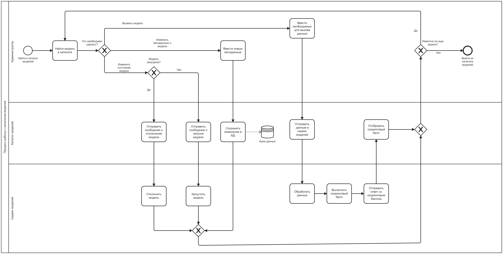

# Проект «Каталог моделей машинного обучения»
## 1. BPMN-диаграмма процесса работы в каталоге моделей

## 2. Sequence-диаграмма

*Диаграмма описывает внутренние процессы сервиса "Model catalog service".*
## 3. ER диаграмма

*Диаграмма описывает модель данных сервиса "Model catalog service" на физическом уровне.*
## 4. Спецификация OpenAPI

*Спецификация описывает интерфейс взаимодействия с сервисом "Model catalog service".*
## 5. Основные макеты 

*Макеты были разработы в Figma.*
## 6. Основа для ТЗ

# Верхнеуровневая постановка для функционала добавления карточки товара на маркетплейс
## 1. User Stories

## 2. Use Case

## 3. Диаграмма процесса в нотации BPMN

## 3. Спецификация OpenAPI

# Сертификат о прохождении курса Analytics учебного центра Neoflex

# Cртификат за участие в хакатоне NEO HACK

